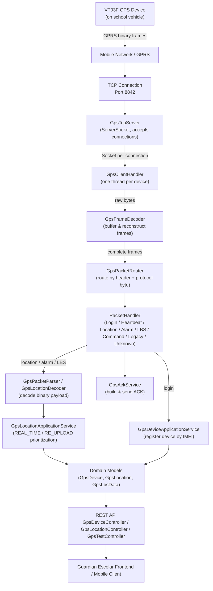
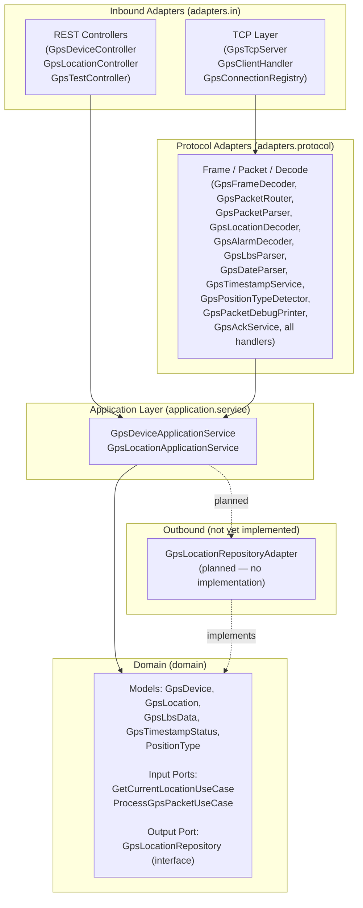

# sg-ms-gps — GPS Microservice Architecture

GPS microservice for Guardian Escolar: receives VT03F device packets over TCP, decodes them, stores current location in memory, and exposes the data via REST API.

- **Spring Boot:** 4.1.1
- **Java:** 21
- **Build:** Maven
- **Document last updated:** 2025-07-14

---

## Table of Contents

1. [Overview](#1-overview)
2. [GPS Device — VT03F](#2-gps-device--vt03f)
3. [GPS Communication Architecture](#3-gps-communication-architecture)
4. [TCP Communication](#4-tcp-communication)
5. [VT03F Protocol — Packet Types](#5-vt03f-protocol--packet-types)
6. [Packet Frame Format](#6-packet-frame-format)
7. [Frame Reconstruction — GpsFrameDecoder](#7-frame-reconstruction--gpsframedecoder)
8. [GPS Location Decoding](#8-gps-location-decoding)
9. [Position Types](#9-position-types)
10. [GPS Timestamps](#10-gps-timestamps)
11. [LBS Data — Packet 0x50](#11-lbs-data--packet-0x50)
12. [GPS Alarms — Packet 0x32](#12-gps-alarms--packet-0x32)
13. [Commands — Packet 0x80](#13-commands--packet-0x80)
14. [Legacy Packets — Header 0x79 0x79](#14-legacy-packets--header-0x79-0x79)
15. [ACK System — GpsAckService](#15-ack-system--gpsackservice)
16. [Hexagonal Architecture](#16-hexagonal-architecture)
17. [Domain Models](#17-domain-models)
18. [Input and Output Ports](#18-input-and-output-ports)
19. [Application Services](#19-application-services)
20. [REST API Reference](#20-rest-api-reference)
21. [Current Location Behavior](#21-current-location-behavior)
22. [Persistence Status](#22-persistence-status)
23. [SQL Server Integration](#23-sql-server-integration)
24. [Configuration Reference](#24-configuration-reference)
25. [Docker](#25-docker)
26. [Running the Service](#26-running-the-service)
27. [Testing](#27-testing)
28. [End-to-End GPS Flow](#28-end-to-end-gps-flow)
29. [Project Structure](#29-project-structure)
30. [Future Development](#30-future-development)
31. [Technical Glossary](#31-technical-glossary)

---

## 1. Overview

`sg-ms-gps` is the GPS microservice for the **Guardian Escolar** school transport tracking platform. It runs two servers simultaneously:

| Protocol | Port | Purpose |
|----------|------|---------|
| HTTP (REST) | **8080** | Query device state and location |
| TCP (GPS) | **8842** | Receive binary packets from VT03F devices |

**Technology stack:** Java 21 · Spring Boot 4.1.1 · Maven · Lombok

**Persistence:** in-memory only (`ConcurrentHashMap`). SQL Server and JPA dependencies are declared in `pom.xml` but DataSource autoconfiguration is disabled in `application.properties`. Restarting the service clears all location data.

**Entry point:** `GpsBackendApplication` implements `CommandLineRunner`. Spring Boot starts the HTTP server automatically; the `run()` method then starts `GpsTcpServer` on a dedicated daemon thread (`gps-tcp-server`).

---

## 2. GPS Device — VT03F

| Property | Value |
|---|---|
| **Model** | VT03F |
| **Manufacturer** | Not documented / Not available in the current project. |
| **Device type** | GPS/GPRS vehicle tracker |
| **Function in Guardian Escolar** | Installed on school vehicles; sends location, heartbeat, alarm, LBS, and command packets to the backend over TCP/GPRS |
| **Communication protocol** | TCP (binary protocol, VT03F frame format) |
| **Server TCP port** | **8842** (hardcoded in `GpsTcpServer.PORT`) |
| **IMEI used in tests** | `123456789012345` and `355468590730586` (appear in `GpsBackendApplicationTests.java` and `GpsLocationServiceTests.java`) |
| **Heartbeat interval** | Not documented / Not available in the current project. (`HeartbeatPacketHandler` logs receipt but stores no interval config) |
| **GPS timezone** | UTC. `GpsDateParser.VT03F_UTC = ZoneOffset.UTC`. The device sends dates as raw BCD bytes interpreted as UTC. Colombia time (UTC-5) is derived for display only in `GpsTimestampService.formatColombiaTime()` |
| **APN / SIM / network config** | Not documented / Not available in the current project. |
| **Known commands** | Not documented / Not available in the current project. (`CommandPacketHandler` acknowledges inbound 0x80 packets but defines no outbound command set; `GpsConnectionRegistry.send()` accepts raw bytes) |

---

## 3. GPS Communication Architecture



---

## 4. TCP Communication

### GpsTcpServer

- Declares `private static final int PORT = 8842`.
- `start()` spawns a daemon `Thread` named `gps-tcp-server` that calls `runServer()`.
- `runServer()` opens a `ServerSocket(PORT)` and loops forever calling `serverSocket.accept()`.
- Each accepted `Socket` triggers a new thread named `gps-client-<port>` that calls `clientHandler.handle(socket)`.
- Exposes two public helpers used by the REST layer:
  - `isGpsConnected(String imei)` — delegates to `GpsConnectionRegistry.isConnected()`
  - `sendToGps(String imei, byte[] command)` — delegates to `GpsConnectionRegistry.send()`
- Contains a private `buildAck(byte[], int)` method that delegates to `GpsAckService.buildAck()`. This method exists for backward-compatibility with reflection-based tests in `GpsBackendApplicationTests`.

### GpsClientHandler

- Manages one GPS connection end-to-end.
- Creates its own `GpsFrameDecoder` instance (one decoder per connection — essential so that partial frames from one device cannot mix with bytes from another).
- Reads bytes from `InputStream` into a 4096-byte buffer in a `while(true)` loop.
- Passes each chunk to `frameDecoder.feed()` which returns a list of complete frames.
- For each complete frame, calls `packetRouter.route(socket, frame, frame.length, currentImei)`.
- If the router returns a non-null IMEI (set during login), stores it as `currentImei` and calls `connectionRegistry.register(currentImei, socket)`.
- On `IOException` or when `read()` returns -1, falls through to the `finally` block: calls `connectionRegistry.remove()`, closes the socket.

### GpsConnectionRegistry

- Maintains `ConcurrentHashMap<String, Socket> connections` (IMEI → Socket).
- `register(imei, socket)` — stores the mapping.
- `remove(imei, socket)` — removes only if the stored socket matches (avoids removing a new reconnection).
- `isConnected(imei)` — checks the socket is non-null, not closed, and `isConnected()`.
- `send(imei, byte[])` — writes bytes to the socket's `OutputStream`; returns `false` if not connected or on error.

### Full connection lifecycle

```
1. VT03F opens TCP connection to port 8842
2. GpsTcpServer.accept() returns Socket
3. New thread → GpsClientHandler.handle(socket)
4. GpsFrameDecoder created (per-connection)
5. bytes arrive → GpsFrameDecoder.feed() reconstructs frames
6. frame[3] == 0x01 → LoginPacketHandler extracts IMEI, registers device, sends ACK
7. currentImei stored; GpsConnectionRegistry maps IMEI → socket
8. Subsequent frames routed by protocol byte to the relevant handler
9. Each handler may call GpsPacketParser, persist data, and always sends ACK
10. read() returns -1 (device disconnects) → cleanup, socket.close()
```

---

## 5. VT03F Protocol — Packet Types

Protocol numbers are read from `data[3]` for standard (0x78 0x78) frames. Legacy (0x79 0x79) frames are dispatched unconditionally to `LegacyPacketHandler`. Protocol numbers are confirmed in `GpsPacketRouter.handlerFor()` switch statement.

| Packet Type | Protocol Number | Header | Handler Class | Purpose | ACK Sent |
|---|---|---|---|---|---|
| Login | `0x01` | `78 78` | `LoginPacketHandler` | Device identifies itself; IMEI extracted and stored | ✅ Yes |
| Heartbeat | `0x13` | `78 78` | `HeartbeatPacketHandler` | Keepalive from device; logged, no data stored | ✅ Yes |
| Location | `0x31` | `78 78` | `LocationPacketHandler` | Real-time or re-upload GPS position | ✅ Yes |
| Alarm | `0x32` | `78 78` | `AlarmPacketHandler` | Device alarm event; decoded and logged | ✅ Yes |
| LBS | `0x50` | `78 78` | `LbsPacketHandler` | Cell tower data (LBS); parsed and logged | ✅ Yes |
| Command | `0x80` | `78 78` | `CommandPacketHandler` | Command response from device; logged | ✅ Yes |
| Legacy | `0x94` (sub-protocol) | `79 79` | `LegacyPacketHandler` | Older or alternate protocol frames | ❌ No ACK |
| Unknown | any other | any other | `UnknownPacketHandler` | Unrecognised header or protocol; first 2 bytes logged | ❌ No ACK |

---

## 6. Packet Frame Format

### Standard frame (header `78 78`)

Confirmed by `GpsFrameDecoder`, `GpsPacketRouter`, `GpsAckService`, and test data in `GpsBackendApplicationTests`.

```
Byte offset   Field             Size    Notes
-----------   ---------------   ------  --------------------------------
0             Header byte 1     1       0x78
1             Header byte 2     1       0x78
2             Length            1       Number of bytes from byte[3] to
                                        last byte before footer (excl. footer).
                                        Full frame length = length_field + 5
3             Protocol number   1       0x01 / 0x13 / 0x31 / 0x32 / 0x50 / 0x80
4..N-6        Payload           var     Protocol-specific content
N-5..N-4      Serial number     2       Big-endian sequence number
N-3..N-2      CRC-16            2       Covers bytes[2..N-4] inclusive (poly 0x1021)
N-1           Footer byte 1     1       0x0D
N             Footer byte 2     1       0x0A
```

Example — Heartbeat frame (12 bytes, from `GpsFrameDecoderTests.heartbeatFrame()`):

```
78 78  05  13  00 00  00 00  00 00  0D 0A
│  │   │   │   └──┘  └──┘   └──┘   │  │
│  │   │   │   payload serial CRC  │  └── Footer 0x0A
│  │   │   │                       └───── Footer 0x0D
│  │   │   └── Protocol 0x13 (Heartbeat)
│  │   └─────── Length = 5 (payload 0 bytes + protocol 1 + serial 2 + CRC 2)
└──┴─────────── Header 78 78
```

### Legacy frame (header `79 79`)

```
Byte offset   Field             Size    Notes
-----------   ---------------   ------  --------------------------------
0             Header byte 1     1       0x79
1             Header byte 2     1       0x79
2..3          Length            2       Big-endian; full frame = length + 6
4             Protocol number   1       e.g. 0x94
5             Sub-type          1       Present when protocol == 0x94
6..N-2        Payload           var
N-1           Footer byte 1     1       0x0D
N             Footer byte 2     1       0x0A
```

Confirmed by `GpsFrameDecoder.declaredMinimumLength()` and `LegacyPacketHandler`.

### ACK frame (10 bytes, fixed)

Confirmed in `GpsAckService.buildAck()` and verified by multiple tests in `GpsBackendApplicationTests`:

```
Byte   Field             Value / Source
----   ---------------   -------------------------------------------
0      Header byte 1     0x78
1      Header byte 2     0x78
2      Length            0x05 (fixed: protocol 1 + serial 2 + CRC 2)
3      Protocol          Copied from data[3] (echoes the received protocol)
4      Serial high byte  Copied from received packet's serial (data[length-6])
5      Serial low byte   Copied from received packet's serial (data[length-5])
6      CRC high byte     CRC-16 over bytes[2..5] inclusive
7      CRC low byte
8      Footer            0x0D
9      Footer            0x0A
```

---

## 7. Frame Reconstruction — GpsFrameDecoder

`GpsFrameDecoder` solves the fundamental TCP streaming problem: a single `read()` call may return part of a frame, a full frame, or multiple concatenated frames.

**Internal state:** a `ByteArrayOutputStream pending` accumulates bytes across multiple `feed()` calls.

**Algorithm in `feed(byte[] data, int length)`:**

1. Appends new bytes to `pending`.
2. Loops until no more complete frames can be extracted:
   a. Calls `findHeader(buffer)` — scans for `0x78 0x78` or `0x79 0x79`. Returns index of first found header.
   b. If no header is found, calls `keepPossibleHeaderPrefix()` (keeps the last byte if it is `0x78` or `0x79`, in case the second byte of a header hasn't arrived yet) and breaks.
   c. If the header starts after index 0, discards leading garbage bytes.
   d. Calls `declaredMinimumLength(buffer)` to compute the minimum expected frame length from the length field:
      - Standard (`0x78`): `buffer[2] + 5`
      - Legacy (`0x79`): `((buffer[2] << 8) | buffer[3]) + 6`
   e. Calls `findFooter(buffer, minimumLength)` — scans for `0x0D 0x0A` starting from `max(4, minimumLength) - 2`.
   f. If footer not found and `pending.length > MAX_FRAME_SIZE (8192)`, discards 1 byte and continues (anti-stall safety).
   g. If footer found at index `frameEnd`, extracts `buffer[0..frameEnd+1]` as a complete frame, discards it from `pending`, and continues the loop.
3. Returns the list of complete frames.

**Concurrency:** `feed()` is `synchronized` — safe for a single-threaded handler (each `GpsClientHandler` owns its own decoder instance).

---

## 8. GPS Location Decoding

`GpsLocationDecoder.decode(byte[] data, int length, String imei, Instant receivedAt)` processes protocol `0x31` packets. Returns `null` if data is null, length < 22, or `data[3] != 0x31`.

All byte offsets below are confirmed from the source code:

| Field | Byte offset | Extraction method | Notes |
|---|---|---|---|
| GPS timestamp | `data[4..9]` | `GpsDateParser.parse(data, 4, "0x31")` | 6 bytes: yy mm dd hh mi ss, interpreted as UTC |
| Satellites | `data[10]` | `data[10] & 0x0F` | Lower 4 bits only |
| Latitude | `data[11..14]` | `readUnsignedInt(data, 11) / 1800000.0` | Big-endian unsigned 32-bit; result in decimal degrees |
| Longitude | `data[15..18]` | `readUnsignedInt(data, 15) / 1800000.0` | Same formula; negated if > 0 (Western hemisphere correction) |
| Speed | `data[19]` | `data[19] & 0xFF` | km/h, unsigned byte |
| Course + status | `data[20..21]` | `((data[20] & 0xFF) << 8) \| (data[21] & 0xFF)` | Lower 10 bits = course in degrees (`& 0x03FF`) |
| Position type | `data[0..length-1]` | `GpsPositionTypeDetector.detect(data, length)` | Reads extension byte at `data[length-7]` |

After extraction, `GpsLocationDecoder` sets `status = "ACTIVE"` and calls `GpsTimestampService.determineStatus()` for the `GpsTimestampStatus`. The full `GpsLocation` object is then printed to stdout via `GpsPacketDebugPrinter`.

**Longitude sign convention (from code):** the raw value from the packet is always positive. If `longitude > 0` after division, the code negates it. This places all decoded coordinates in the Western hemisphere (correct for Colombia).

---

## 9. Position Types

### PositionType enum (`gps_backend.domain.model.PositionType`)

| Value | Meaning |
|---|---|
| `REAL_TIME` | Position sent by the device in real time |
| `RE_UPLOAD` | Position previously stored in device memory and re-sent later |
| `UNKNOWN` | Could not be determined from the packet structure |

### Detection — GpsPositionTypeDetector

`detect(byte[] data, int length)` reads byte `data[length - 7]` (the re-upload extension byte) only when **all** of the following conditions are met (verified in source):

- `extensionStart (= length - 9) >= 22`
- `length >= 31`
- Frame is structurally standard: header `78 78`, `data[2] + 5 == length`, footer `0x0D 0x0A`

If the conditions pass:
- `data[length - 7] == 0` → `REAL_TIME`
- `data[length - 7] != 0` → `RE_UPLOAD`

Otherwise returns `UNKNOWN`.

### Prioritization — GpsLocationApplicationService

The `save(GpsLocation location)` method uses `ConcurrentHashMap.compute()` with this logic:

```
if (current != null
    && current.positionType == REAL_TIME
    && incoming.positionType == RE_UPLOAD)
    → keep current (discard RE_UPLOAD)
else
    → store incoming
```

In plain terms:
- A **REAL_TIME** position always replaces the previous position (even another REAL_TIME).
- A **RE_UPLOAD** is stored only if there is no REAL_TIME position already stored for that IMEI.
- An initial RE_UPLOAD (no previous position) is accepted.

This is validated by four tests in `GpsLocationServiceTests`.

---

## 10. GPS Timestamps

### GpsDateParser

- `parse(byte[] data, int startIndex, String protocolLabel)` converts 6 consecutive bytes to `OffsetDateTime`.
- Format: `data[startIndex+0]` = year-2000 offset (yy), `+1` = month, `+2` = day, `+3` = hour, `+4` = minute, `+5` = second.
- Each byte is read as unsigned (`& 0xFF`) and must be ≤ 99; values > 99 throw `IllegalArgumentException`.
- Result: `OffsetDateTime.of(2000 + yy, mm, dd, hh, mi, ss, 0, ZoneOffset.UTC)`.
- Constant `GpsDateParser.VT03F_UTC = ZoneOffset.UTC` documents the device's timezone.

### GpsTimestampService

`determineStatus(Instant gpsDateTime, Instant receivedAt)`:

| Condition | Result |
|---|---|
| Either argument is `null` | `GpsTimestampStatus.INVALID` |
| `\|gpsDateTime − receivedAt\| ≤ 300 seconds (5 minutes)` | `GpsTimestampStatus.VALID` |
| `\|gpsDateTime − receivedAt\| > 300 seconds` | `GpsTimestampStatus.STALE` |

`formatColombiaTime(Instant instant)`: formats an `Instant` using `ZoneId.of("America/Bogota")` and pattern `"yyyy-MM-dd HH:mm:ss"`. Used for console display only; stored values remain in UTC.

### GpsTimestampStatus enum

| Value | Meaning |
|---|---|
| `VALID` | GPS timestamp differs from server reception time by ≤ 5 minutes |
| `STALE` | GPS timestamp differs from server reception time by > 5 minutes |
| `INVALID` | GPS timestamp or server reception timestamp is null |

---

## 11. LBS Data — Packet 0x50

### What is LBS

LBS (Location Based Services) data provides cell tower information from the device's GPRS modem. It supplements GPS coordinates with mobile network cell data.

### GpsLbsData model fields

| Field | Type | Description |
|---|---|---|
| `imei` | `String` | Device identifier |
| `dateTime` | `OffsetDateTime` | GPS date from packet bytes [4..9], UTC |
| `gpsDateTime` | `Instant` | Same date as `Instant` |
| `receivedAt` | `Instant` | Server reception timestamp |
| `timestampStatus` | `GpsTimestampStatus` | VALID / STALE / INVALID |
| `ta` | `int` | Timing Advance (`data[10]`) |
| `mcc` | `int` | Mobile Country Code (`data[11..12]`, unsigned short) |
| `mnc` | `int` | Mobile Network Code (`data[13]`, unsigned byte) |
| `lac` | `int` | Location Area Code (`data[14..15]`, unsigned short) |
| `cellId` | `long` | Cell Identifier (`data[16..19]`, unsigned 32-bit) |
| `signalStrength` | `int` | Signal strength (`data[20]`, unsigned byte) |
| `status` | `String` | Hardcoded `"ACTIVE"` |

### GpsLbsParser.parse() byte layout (0x50)

Packet must be at least 22 bytes and `data[3] == 0x50`.

| Byte index | Field |
|---|---|
| `[3]` | Protocol 0x50 |
| `[4..9]` | GPS date (yy mm dd hh mi ss) |
| `[10]` | TA (Timing Advance) |
| `[11..12]` | MCC (2 bytes, big-endian) |
| `[13]` | MNC |
| `[14..15]` | LAC (2 bytes, big-endian) |
| `[16..19]` | Cell ID (4 bytes, big-endian) |
| `[20]` | Signal strength |

### Current status

`LbsPacketHandler` calls `GpsLbsParser.parse()` and sends ACK. The returned `GpsLbsData` object is **not stored** anywhere — it is only printed to stdout via `System.out.println()` inside `GpsLbsParser`. There is no persistence or further use of LBS data in the current implementation.

---

## 12. GPS Alarms — Packet 0x32

### How alarms arrive

An alarm packet uses header `78 78`, protocol byte `0x32`. It is routed to `AlarmPacketHandler` by `GpsPacketRouter`.

### GpsAlarmDecoder.decode()

- Validates: not null, length ≥ 10, `data[3] == 0x32`.
- Calls `GpsDateParser.parse(data, 4, "0x32")` to extract the GPS timestamp from `data[4..9]`.
- Calls `GpsTimestampService.determineStatus()`.
- Delegates all output to `GpsPacketDebugPrinter.printAlarm()`, which logs:
  - IMEI, raw packet in hex, per-byte table, protocol number, GPS date (UTC and Colombia), server received time (Colombia), timestamp status.

### AlarmPacketHandler

```java
packetParser.parseAlarm(data, length, currentImei, Instant.now());
ackService.sendAck(socket, data, length);
return currentImei;
```

### Current status

Alarm data is **decoded and logged to stdout only**. No alarm object is stored, persisted, or forwarded. The handler sends ACK and returns `currentImei` unchanged.

---

## 13. Commands — Packet 0x80

### CommandPacketHandler

Routes when `GpsPacketRouter` receives header `78 78` with protocol `0x80`.

```java
System.out.println("Comando recibido desde GPS.");
ackService.sendAck(socket, data, length);
return currentImei;
```

The handler logs a message, sends ACK, and takes no further action. No command payload is parsed or stored.

### Outbound command sending

`GpsConnectionRegistry.send(String imei, byte[] command)` allows sending raw bytes to a connected device. `GpsTcpServer.sendToGps()` exposes this publicly. No outbound command format or vocabulary is defined in the current codebase.

---

## 14. Legacy Packets — Header 0x79 0x79

`GpsPacketRouter` detects header `79 79` (`first == 0x79 && second == 0x79`) and delegates unconditionally to `LegacyPacketHandler` — no protocol-byte dispatch.

### LegacyPacketHandler

```java
int declaredLength = ((data[2] & 0xFF) << 8) | (data[3] & 0xFF);
int protocol = data[4] & 0xFF;
// logs: Paquete 79 79: longitud=N, protocolo=0xXX

if (protocol == 0x94 && length > 5) {
    int subtype = data[5] & 0xFF;
    // logs: Protocolo 0x94, subtipo=0xXX
}
return currentImei;
```

- For packets shorter than 6 bytes, logs a warning and returns immediately.
- Reads a 2-byte big-endian length field at `data[2..3]`.
- Reads the protocol byte at `data[4]`.
- If protocol is `0x94`, reads an additional sub-type byte at `data[5]`.
- **No ACK is sent.** No data is stored.

This handler is a foundation for future support of the alternate frame format. Sub-protocol `0x94` is explicitly recognised but not processed beyond logging.

---

## 15. ACK System — GpsAckService

### When an ACK is sent

| Handler | Sends ACK |
|---|---|
| `LoginPacketHandler` | ✅ |
| `HeartbeatPacketHandler` | ✅ |
| `LocationPacketHandler` | ✅ |
| `AlarmPacketHandler` | ✅ |
| `LbsPacketHandler` | ✅ |
| `CommandPacketHandler` | ✅ |
| `LegacyPacketHandler` | ❌ |
| `UnknownPacketHandler` | ❌ |

### buildAck(byte[] data, int length)

Returns a fixed 10-byte array. Confirmed in source and validated by 5 test methods in `GpsBackendApplicationTests`:

```
ack[0] = 0x78                         // Header
ack[1] = 0x78                         // Header
ack[2] = 0x05                         // Fixed length field
ack[3] = data[3]                      // Protocol echoed from incoming packet
ack[4] = data[length-6] (high byte)   // Serial number from incoming packet
ack[5] = data[length-5] (low byte)    // Serial number from incoming packet
ack[6] = CRC high byte                // CRC-16 over ack[2..5]
ack[7] = CRC low byte
ack[8] = 0x0D                         // Footer
ack[9] = 0x0A                         // Footer
```

Serial number extraction: `serialIndex = length - 6`; `serial = (data[serialIndex] << 8) | data[serialIndex+1]`.

### CRC-16 calculation

Polynomial `0x1021` (CRC-CCITT). Confirmed in `GpsAckService.calculateCrc()`:

```java
int crc = 0;
for (int i = start; i < end; i++) {
    crc ^= data[i] & 0xFF;
    for (int j = 0; j < 8; j++) {
        crc = (crc & 0x8000) != 0
            ? (crc << 1) ^ 0x1021
            : crc << 1;
        crc &= 0xFFFF;
    }
}
```

Applied over `ack[2..5]` (4 bytes: length field + protocol + serial).

---

## 16. Hexagonal Architecture

The project follows a hexagonal (ports and adapters) architecture. Domain and application layers have zero Spring/JPA dependencies; all framework concerns live in the adapters layer.



### Domain (`gps_backend.domain`)

No Spring annotations. No JPA. Pure Java.

- `model/` — 5 domain classes (see [Section 17](#17-domain-models))
- `port/in/` — 2 input port interfaces
- `port/out/` — 1 output port interface (no implementation)

### Application (`gps_backend.application.service`)

- `GpsDeviceApplicationService` — implements no domain port; manages device registry in-memory.
- `GpsLocationApplicationService` — implements `GetCurrentLocationUseCase` and `ProcessGpsPacketUseCase`; stores current location per IMEI.

### Inbound Adapters — REST (`gps_backend.adapters.in.rest`)

| Controller | Base path | Role |
|---|---|---|
| `GpsDeviceController` | `/api/gps` | Query device info |
| `GpsLocationController` | `/api/gps` | Query current location |
| `GpsTestController` | `/api/gps/test` | Inject a test location without a physical device |

### Inbound Adapters — TCP (`gps_backend.adapters.in.tcp`)

| Class | Role |
|---|---|
| `GpsTcpServer` | Opens `ServerSocket(8842)`, spawns per-connection threads |
| `GpsClientHandler` | Reads raw bytes per connection, drives frame decoding and routing |
| `GpsConnectionRegistry` | IMEI → Socket registry; enables outbound command sending |

### Protocol Adapters (`gps_backend.adapters.protocol`)

This sub-package is separate from `adapters.in` because it handles the GPS binary protocol independently of how bytes arrive (TCP today, potentially serial or UDP in future). It has no `@Controller` or `@RestController` annotations.

| Class | Role |
|---|---|
| `GpsFrameDecoder` | Reconstructs complete frames from raw TCP byte stream |
| `GpsPacketRouter` | Routes complete frames to the correct handler by header + protocol byte |
| `GpsPacketHandler` | Interface: `String handle(Socket, byte[], int, String)` |
| `GpsPacketParser` | Facade delegating to `GpsLocationDecoder` and `GpsAlarmDecoder` |
| `GpsLocationDecoder` | Decodes protocol `0x31` payload into `GpsLocation` |
| `GpsAlarmDecoder` | Decodes protocol `0x32` payload (logging only) |
| `GpsLbsParser` | Decodes protocol `0x50` payload into `GpsLbsData` (logging only) |
| `GpsDateParser` | Converts 6-byte GPS date to `OffsetDateTime UTC` |
| `GpsTimestampService` | Compares GPS vs. received timestamps; formats Colombia time for display |
| `GpsPositionTypeDetector` | Determines `REAL_TIME` / `RE_UPLOAD` / `UNKNOWN` from extension byte |
| `GpsPacketDebugPrinter` | Prints diagnostic info to stdout for all packet types |
| `ack/GpsAckService` | Builds and writes the 10-byte ACK to the device socket |
| `handler/LoginPacketHandler` | Processes 0x01 |
| `handler/HeartbeatPacketHandler` | Processes 0x13 |
| `handler/LocationPacketHandler` | Processes 0x31 |
| `handler/AlarmPacketHandler` | Processes 0x32 |
| `handler/LbsPacketHandler` | Processes 0x50 |
| `handler/CommandPacketHandler` | Processes 0x80 |
| `handler/LegacyPacketHandler` | Processes 79 79 frames |
| `handler/UnknownPacketHandler` | Handles unrecognised headers/protocols |

### Outbound Ports

`GpsLocationRepository` (interface in `domain/port/out/`) defines the persistence contract. No adapter implementing it exists. The application service holds data entirely in `ConcurrentHashMap`.

---

## 17. Domain Models

### GpsDevice

| Field | Type | Description |
|---|---|---|
| `imei` | `String` | Unique device identifier |
| `gpsStatus` | `boolean` | `true` when device has connected at least once |
| `lastConnection` | `Instant` | UTC timestamp of most recent connection/update |

### GpsLocation

| Field | Type | Description |
|---|---|---|
| `imei` | `String` | Device that sent this position |
| `latitude` | `double` | Decimal degrees (raw value / 1,800,000) |
| `longitude` | `double` | Decimal degrees, negated for Western hemisphere |
| `speed` | `double` | km/h |
| `course` | `double` | Heading in degrees (0-360) |
| `dateTime` | `OffsetDateTime` | GPS timestamp, UTC |
| `gpsDateTime` | `Instant` | `dateTime.toInstant()` |
| `receivedAt` | `Instant` | Server wall-clock time at packet receipt |
| `timestampStatus` | `GpsTimestampStatus` | VALID / STALE / INVALID |
| `status` | `String` | Fixed value `"ACTIVE"` |
| `positionType` | `PositionType` | REAL_TIME / RE_UPLOAD / UNKNOWN |

### GpsLbsData

| Field | Type | Description |
|---|---|---|
| `imei` | `String` | Device identifier |
| `dateTime` | `OffsetDateTime` | GPS date from packet, UTC |
| `gpsDateTime` | `Instant` | `dateTime.toInstant()` |
| `receivedAt` | `Instant` | Server reception timestamp |
| `timestampStatus` | `GpsTimestampStatus` | VALID / STALE / INVALID |
| `ta` | `int` | Timing Advance |
| `mcc` | `int` | Mobile Country Code |
| `mnc` | `int` | Mobile Network Code |
| `lac` | `int` | Location Area Code |
| `cellId` | `long` | Cell Identifier |
| `signalStrength` | `int` | GPRS signal level |
| `status` | `String` | Fixed value `"ACTIVE"` |

### GpsTimestampStatus

```java
public enum GpsTimestampStatus { VALID, STALE, INVALID }
```

See [Section 10](#10-gps-timestamps) for the threshold logic.

### PositionType

```java
public enum PositionType { REAL_TIME, RE_UPLOAD, UNKNOWN }
```

See [Section 9](#9-position-types) for the detection and prioritization logic.

---

## 18. Input and Output Ports

### GetCurrentLocationUseCase (`domain/port/in/`)

```java
public interface GetCurrentLocationUseCase {
    Optional<GpsLocation> getCurrentLocation(String imei);
}
```

Implemented by `GpsLocationApplicationService`. Called by `GpsLocationController`.

### ProcessGpsPacketUseCase (`domain/port/in/`)

```java
public interface ProcessGpsPacketUseCase {
    void saveLocation(String imei, GpsLocation location);
}
```

Implemented by `GpsLocationApplicationService`. Called by `LocationPacketHandler` (indirectly, via the service's `save()` method).

### GpsLocationRepository (`domain/port/out/`)

```java
public interface GpsLocationRepository {
    void save(String imei, GpsLocation location);
    Optional<GpsLocation> findLatestByImei(String imei);
}
```

**Status:** interface defined; no implementation exists. No Spring bean satisfies this interface at runtime. The application service stores data in its own `ConcurrentHashMap` and does not use this port yet.

---

## 19. Application Services

### GpsDeviceApplicationService

Spring `@Service`. Manages `ConcurrentHashMap<String, GpsDevice> devices`.

| Method | Behaviour |
|---|---|
| `register(String imei)` | `putIfAbsent` — creates device only if IMEI is new |
| `registerDevice(String imei, Socket socket)` | Calls `register()` then `updateConnection()`; socket parameter accepted for API compatibility but not stored |
| `updateConnection(String imei)` | Sets `gpsStatus = true` and `lastConnection = Instant.now()` on existing device; calls `register()` first if device not found |
| `getDevice(String imei)` | Returns `GpsDevice` or `null` |
| `exists(String imei)` | Returns `true` if IMEI is in the map |

### GpsLocationApplicationService

Spring `@Service`. Implements `GetCurrentLocationUseCase` and `ProcessGpsPacketUseCase`.

Manages `ConcurrentHashMap<String, GpsLocation> locations` (one entry per IMEI — current location only).

| Method | Behaviour |
|---|---|
| `saveLocation(String imei, GpsLocation location)` | Port implementation; delegates to `save()` |
| `save(GpsLocation location)` | Applies REAL_TIME / RE_UPLOAD prioritization via `compute()`; logs to stdout |
| `getCurrentLocation(String imei)` | Port implementation; delegates to `getLatest()` |
| `getLatest(String imei)` | Returns `locations.get(imei)` or `null` |

**Prioritization rule** (from source):

```
compute(imei, (key, current) ->
    current != null
    && current.positionType == REAL_TIME
    && incoming.positionType == RE_UPLOAD
    ? current          // keep existing REAL_TIME, discard RE_UPLOAD
    : location         // store incoming in all other cases
)
```

---

## 20. REST API Reference

All controllers share base path `/api/gps`. HTTP port is `8080`.

---

### GET /api/gps/devices/{imei}

- **Controller:** `GpsDeviceController`
- **Parameter:** `imei` (path variable, String)
- **Returns:** `GpsDevice` JSON, or `null` / empty body if device not registered
- **Status codes:** `200 OK` (Spring default; returns `null` body if not found — no explicit 404)
- **Example request:**
  ```
  GET http://localhost:8080/api/gps/devices/355468590730586
  ```
- **Example response:**
  ```json
  {
    "imei": "355468590730586",
    "gpsStatus": true,
    "lastConnection": "2025-07-14T20:15:00Z"
  }
  ```

---

### GET /api/gps/devices/{imei}/connected

- **Controller:** `GpsDeviceController`
- **Parameter:** `imei` (path variable, String)
- **Returns:** `boolean` — `true` if device is registered and `gpsStatus == true`
- **Status codes:** `200 OK`
- **Example request:**
  ```
  GET http://localhost:8080/api/gps/devices/355468590730586/connected
  ```
- **Example response:**
  ```
  true
  ```

---

### GET /api/gps/devices/{imei}/location

- **Controller:** `GpsLocationController`
- **Parameter:** `imei` (path variable, String)
- **Returns:** `GpsLocation` JSON, or `null` / empty body if no location stored
- **Status codes:** `200 OK` (returns `null` body if not found — no explicit 404)
- **Example request:**
  ```
  GET http://localhost:8080/api/gps/devices/355468590730586/location
  ```
- **Example response:**
  ```json
  {
    "imei": "355468590730586",
    "latitude": 2.912000,
    "longitude": -75.307000,
    "speed": 19.5,
    "course": 20.0,
    "dateTime": "2025-07-14T20:15:00Z",
    "gpsDateTime": "2025-07-14T20:15:00Z",
    "receivedAt": "2025-07-14T20:15:01Z",
    "timestampStatus": "VALID",
    "status": "ACTIVE",
    "positionType": "REAL_TIME"
  }
  ```

---

### POST /api/gps/test/{imei}

- **Controller:** `GpsTestController` (`@RequestMapping("/api/gps/test")`)
- **Parameter:** `imei` (path variable, String)
- **Body:** none
- **Action:** Creates a hardcoded test `GpsLocation` (lat `2.912000`, lon `-75.307000`, speed `19.5`, course `20`, `OffsetDateTime.now(UTC)`, status `"ACTIVE"`, positionType `UNKNOWN`) and saves it via `GpsLocationApplicationService.save()`.
- **Returns:** The created `GpsLocation` JSON
- **Status codes:** `200 OK`
- **Example request:**
  ```
  POST http://localhost:8080/api/gps/test/355468590730586
  ```

> **Note:** No `/history` endpoint exists in the current codebase.

---

## 21. Current Location Behavior

**Update cycle when a 0x31 packet arrives:**

1. `GpsTcpServer` accepts the TCP connection; `GpsClientHandler` reads bytes.
2. `GpsFrameDecoder` reconstructs the complete frame.
3. `GpsPacketRouter` identifies protocol `0x31` → `LocationPacketHandler`.
4. `LocationPacketHandler` checks `currentImei != null`; if null, logs an error and still sends ACK.
5. Calls `GpsPacketParser.parseLocation(data, length, currentImei, Instant.now())`.
6. `GpsLocationDecoder` extracts all fields and returns a `GpsLocation`.
7. `LocationPacketHandler` calls `GpsLocationApplicationService.save(location)`.
8. `save()` applies REAL_TIME / RE_UPLOAD prioritization in the `ConcurrentHashMap`.
9. `GpsAckService.sendAck()` sends the 10-byte ACK back to the device.

**Query cycle:**

1. Client calls `GET /api/gps/devices/{imei}/location`.
2. `GpsLocationController.getLatestLocation(imei)` calls `gpsLocationService.getLatest(imei)`.
3. Returns `locations.get(imei)` — the single current location per IMEI, or `null`.

---

## 22. Persistence Status

| Status | Detail |
|---|---|
| ❌ No GPS persistence implemented | No location, device, LBS, or alarm data is written to any database |
| ✅ `GpsLocationRepository` defined as output port | Interface exists in `domain/port/out/` |
| ❌ No `GpsLocationRepositoryAdapter` exists | The interface has no implementation; no Spring bean satisfies it |
| ⚠️ All state is in-memory | Restarting the service clears all registered devices and stored locations |
| ⚠️ SQL Server driver declared | `pom.xml` includes `mssql-jdbc` at runtime scope |
| ❌ DataSource autoconfiguration disabled | `spring.autoconfigure.exclude` in `application.properties` prevents any DB connection attempt at startup |

---

## 23. SQL Server Integration

### Dependencies in `pom.xml`

```xml
<!-- Persistencia JPA -->
<dependency>
    <groupId>org.springframework.boot</groupId>
    <artifactId>spring-boot-starter-data-jpa</artifactId>
</dependency>

<!-- SQL Server -->
<dependency>
    <groupId>com.microsoft.sqlserver</groupId>
    <artifactId>mssql-jdbc</artifactId>
    <scope>runtime</scope>
</dependency>
```

### DataSource disabled in `application.properties`

```properties
spring.autoconfigure.exclude=org.springframework.boot.jdbc.autoconfigure.DataSourceAutoConfiguration,org.springframework.boot.hibernate.autoconfigure.HibernateJpaAutoConfiguration
```

Both `DataSourceAutoConfiguration` and `HibernateJpaAutoConfiguration` are excluded, so no JDBC connection is attempted and no Hibernate session factory is created at startup.

### Current state

- No JPA `@Entity` class exists.
- No Spring Data `JpaRepository` interface exists.
- No `@Repository` implementation of `GpsLocationRepository` exists.

### Planned

A future `GpsLocationRepositoryAdapter` class will:
- Be annotated `@Repository`
- Implement `GpsLocationRepository` (output port)
- Use Spring Data JPA or JDBC to persist `GpsLocation` entries to SQL Server
- Allow `GpsLocationApplicationService` to be wired to real persistence

---

## 24. Configuration Reference

### `src/main/resources/application.properties`

```properties
# Application name used by Spring Boot
spring.application.name=gps-backend

# Disable DataSource and JPA autoconfiguration (no DB connection while GPS is being tested)
spring.autoconfigure.exclude=org.springframework.boot.jdbc.autoconfigure.DataSourceAutoConfiguration,org.springframework.boot.hibernate.autoconfigure.HibernateJpaAutoConfiguration

# HTTP port for the REST API
server.port=8080
```

### TCP port 8842

The GPS TCP port is **not** in `application.properties`. It is hardcoded in `GpsTcpServer`:

```java
private static final int PORT = 8842;
```

Moving this value to `application.properties` is listed in [Section 30 — Future Development](#30-future-development).

---

## 25. Docker

Both files exist at the project root but are **not tracked by git** (confirmed by prior analysis).

### Dockerfile

Multi-stage build:

```dockerfile
FROM maven:3.9-eclipse-temurin-21 AS build
WORKDIR /app
COPY pom.xml .
COPY src ./src
RUN mvn clean package -DskipTests

FROM eclipse-temurin:21-jre AS final
WORKDIR /app
COPY --from=build /app/target/*.jar app.jar
EXPOSE 8080
EXPOSE 8842
ENTRYPOINT ["java", "-jar", "app.jar"]
```

- Stage 1: builds the JAR with Maven.
- Stage 2: minimal JRE image with only the JAR.
- Exposes both ports: `8080` (HTTP REST) and `8842` (GPS TCP).

### docker-compose.yml

```yaml
services:
  ms-gps:
    container_name: ms-gps
    image: ms-gps.api
    build:
      context: .
      dockerfile: Dockerfile
    ports:
      - "8084:8080"
      - "8842:8842"
    networks:
      - sg-services-network

networks:
  sg-services-network:
    external: true
```

| Port mapping | Meaning |
|---|---|
| `8084:8080` | External port 8084 → internal HTTP REST port 8080 |
| `8842:8842` | External GPS TCP port 8842 → internal GPS TCP port 8842 |

The `sg-services-network` is declared as external — it must be created separately before running `docker compose up`.

> Both `Dockerfile` and `docker-compose.yml` are untracked in git. They will not be included in a `git clone` of the repository until explicitly added and committed.

---

## 26. Running the Service

### Prerequisites

- Java 21
- Maven (or use included Maven wrapper `mvnw.cmd`)

### Run tests

```bash
.\mvnw.cmd clean test
```

Expected output: 17/17 tests pass (GpsBackendApplicationTests: 11, GpsFrameDecoderTests: 2, GpsLocationServiceTests: 4).

### Run locally

```bash
.\mvnw.cmd spring-boot:run
```

### Verify active ports after startup

- HTTP REST: `http://localhost:8080/api/gps/devices/TEST`
- GPS TCP: connect with netcat or a VT03F device to `localhost:8842`

Console output on successful startup:

```
=================================
   GPS TCP SERVER INICIADO
   Puerto: 8842
=================================
```

### Docker build and run

```bash
docker compose up --build
```

HTTP API will be available on port `8084` (mapped from `8080`). GPS TCP on `8842`.

---

## 27. Testing

### GpsBackendApplicationTests (11 tests)

| Test method | What it validates |
|---|---|
| `contextLoads()` | Spring context starts successfully (all beans wire correctly, TCP server starts) |
| `gpsPacketParserShouldDecodeVt03fTimestampAsUtc()` | `GpsPacketParser.parseLocation()` decodes a 0x31 packet's 6-byte date (`1A 09 15 14 1A 10`) as `2026-09-21T20:26:16Z` |
| `gpsPacketParserShouldDecodeAlarmTimestampAsUtc()` | 0x32 packet date bytes (`1A 09 16 0D 14 29`) parse to `2026-09-22T13:20:41Z`; Colombia offset confirmed as UTC-5 |
| `gpsLbsParserShouldKeepProtocolDateWithoutManualTimezoneShift()` | 0x50 packet date stored as UTC without manual timezone correction |
| `gpsTcpServerShouldBuildAckForAlarmPacket()` | ACK for 0x32: header `78 78`, protocol byte `0x32`, terminator `0D 0A` |
| `gpsTcpServerShouldUseTheRealSerialForGpsPositionAck()` | Serial bytes from a real 0x31 packet (`0x00 0x02`) are echoed in the ACK |
| `gpsTcpServerShouldBuildAckForLbsPacket()` | ACK for 0x50: header `78 78`, protocol byte `0x50`, at least 10 bytes |
| `gpsPacketParserShouldParseLocationDataWithoutLosingDateMetadata()` | `parseLocation()` preserves all fields; satellites = `data[10] & 0x0F` |
| `gpsPacketParserShouldUseTheReceiveInstantProvidedByTheServer()` | `receivedAt` is preserved exactly; `timestampStatus` is `VALID` when GPS and received times differ by 1 second |
| `gpsTcpServerShouldBuildAckForLoginPacket()` | ACK for 0x01: protocol byte `0x01`, terminator `0D 0A` |
| `gpsTcpServerShouldBuildAckForHeartbeatPacket()` | ACK for 0x13: header `78 78`, protocol byte `0x13` |

> ACK-related tests invoke the private `buildAck(byte[], int)` method on `GpsTcpServer` via reflection (`getDeclaredMethod` + `setAccessible(true)`). The secondary `GpsTcpServer` constructor accepting service/parser params creates a minimal instance suitable for this without starting a real `ServerSocket`.

### GpsFrameDecoderTests (2 tests)

| Test method | What it validates |
|---|---|
| `shouldWaitForACompleteFrameWhenTcpSplitsIt()` | Feeds the first 5 bytes of a heartbeat frame; expects 0 frames; feeds remaining bytes; expects 1 complete frame of correct length |
| `shouldReturnEveryFrameWhenTcpCombinesSeveralFrames()` | Feeds two heartbeat frames concatenated in one `feed()` call; expects exactly 2 frames returned |

Test frame used in both tests: `78 78 05 13 00 00 00 00 00 00 0D 0A` (12 bytes).

### GpsLocationServiceTests (4 tests)

| Test method | What it validates |
|---|---|
| `shouldReplaceCurrentLocationWithNewRealTimeLocation()` | REAL_TIME replaces a previous REAL_TIME |
| `shouldKeepRealTimeLocationWhenReUploadArrives()` | An existing REAL_TIME is kept when a RE_UPLOAD arrives |
| `shouldExposeInitialReUploadAsCurrentLocation()` | A RE_UPLOAD is stored when there is no prior location |
| `shouldReplaceInitialReUploadWithRealTimeLocation()` | REAL_TIME replaces an existing RE_UPLOAD |

### Note on TCP port during @SpringBootTest

`contextLoads()` uses `@SpringBootTest` which starts the full context. `GpsBackendApplication.run()` is called, which starts `GpsTcpServer` and binds to port `8842`. If port `8842` is already in use when the test runs, `contextLoads()` will fail with `BindException`. No Spring test profile to disable TCP is currently defined.

---

## 28. End-to-End GPS Flow

```mermaid
sequenceDiagram
    participant VT03F as VT03F Device
    participant TCP as GpsTcpServer
    participant CH as GpsClientHandler
    participant FD as GpsFrameDecoder
    participant PR as GpsPacketRouter
    participant LH as LoginPacketHandler
    participant LocH as LocationPacketHandler
    participant PP as GpsPacketParser
    participant LS as GpsLocationApplicationService
    participant ACK as GpsAckService
    participant REST as GpsLocationController
    participant Client as REST Client

    VT03F->>TCP: TCP connect to :8842
    TCP->>CH: handle(socket) on new thread
    VT03F->>CH: send Login frame (78 78 .. 01 .. IMEI .. 0D 0A)
    CH->>FD: feed(bytes)
    FD-->>CH: [complete frame]
    CH->>PR: route(socket, frame, length, null)
    PR->>LH: handle(socket, data, length, null)
    LH->>LH: extractImei(data) → "355468590730586"
    LH->>LS: deviceService.registerDevice(imei, socket)
    LH->>ACK: sendAck(socket, data, length)
    ACK-->>VT03F: 78 78 05 01 .. .. CRC 0D 0A
    LH-->>PR: return imei
    PR-->>CH: "355468590730586"
    CH->>CH: currentImei = "355468590730586"; registry.register(imei, socket)

    VT03F->>CH: send Location frame (78 78 .. 31 .. 0D 0A)
    CH->>FD: feed(bytes)
    FD-->>CH: [complete frame]
    CH->>PR: route(socket, frame, length, "355468590730586")
    PR->>LocH: handle(socket, data, length, imei)
    LocH->>PP: parseLocation(data, length, imei, Instant.now())
    PP->>PP: GpsLocationDecoder.decode(...)
    PP-->>LocH: GpsLocation{lat, lon, speed, course, ...}
    LocH->>LS: save(location)
    LS->>LS: ConcurrentHashMap.compute (REAL_TIME/RE_UPLOAD priority)
    LocH->>ACK: sendAck(socket, data, length)
    ACK-->>VT03F: 78 78 05 31 .. .. CRC 0D 0A

    Client->>REST: GET /api/gps/devices/355468590730586/location
    REST->>LS: getLatest("355468590730586")
    LS-->>REST: GpsLocation
    REST-->>Client: 200 OK { lat, lon, speed, ... }
```

---

## 29. Project Structure

```
sg-ms-gps/
├── src/
│   ├── main/
│   │   ├── java/gps_backend/
│   │   │   ├── GpsBackendApplication.java          Entry point; starts Spring Boot + TCP server
│   │   │   │
│   │   │   ├── domain/                             Pure domain — no Spring, no JPA
│   │   │   │   ├── model/
│   │   │   │   │   ├── GpsDevice.java              Registered GPS device with IMEI and status
│   │   │   │   │   ├── GpsLocation.java            Decoded GPS position with all fields
│   │   │   │   │   ├── GpsLbsData.java             Cell tower data from 0x50 packets
│   │   │   │   │   ├── GpsTimestampStatus.java     Enum: VALID / STALE / INVALID
│   │   │   │   │   └── PositionType.java           Enum: REAL_TIME / RE_UPLOAD / UNKNOWN
│   │   │   │   └── port/
│   │   │   │       ├── in/
│   │   │   │       │   ├── GetCurrentLocationUseCase.java   Input port: query current location
│   │   │   │       │   └── ProcessGpsPacketUseCase.java     Input port: save decoded location
│   │   │   │       └── out/
│   │   │   │           └── GpsLocationRepository.java       Output port: persist location (not implemented)
│   │   │   │
│   │   │   ├── application/                        Application services — orchestrate domain
│   │   │   │   └── service/
│   │   │   │       ├── GpsDeviceApplicationService.java     In-memory device registry
│   │   │   │       └── GpsLocationApplicationService.java   In-memory location store + prioritization
│   │   │   │
│   │   │   └── adapters/                           All framework/infra adapters
│   │   │       ├── in/
│   │   │       │   ├── rest/                       HTTP REST controllers
│   │   │       │   │   ├── GpsDeviceController.java         GET /devices/{imei}, /connected
│   │   │       │   │   ├── GpsLocationController.java       GET /devices/{imei}/location
│   │   │       │   │   └── GpsTestController.java           POST /test/{imei}
│   │   │       │   └── tcp/                        TCP inbound adapter
│   │   │       │       ├── GpsTcpServer.java                Opens ServerSocket on port 8842
│   │   │       │       ├── GpsClientHandler.java            Reads bytes per connection
│   │   │       │       └── GpsConnectionRegistry.java       IMEI → Socket map
│   │   │       └── protocol/                       GPS binary protocol processing
│   │   │           ├── GpsFrameDecoder.java                 Reconstructs frames from TCP stream
│   │   │           ├── GpsPacketRouter.java                 Routes frames by header + protocol byte
│   │   │           ├── GpsPacketHandler.java                Handler interface
│   │   │           ├── GpsPacketParser.java                 Facade for decoders
│   │   │           ├── GpsLocationDecoder.java              Decodes 0x31 payload
│   │   │           ├── GpsAlarmDecoder.java                 Decodes 0x32 payload (log only)
│   │   │           ├── GpsLbsParser.java                    Decodes 0x50 payload (log only)
│   │   │           ├── GpsDateParser.java                   6-byte GPS date → OffsetDateTime UTC
│   │   │           ├── GpsTimestampService.java             GPS vs. server timestamp comparison
│   │   │           ├── GpsPositionTypeDetector.java         REAL_TIME / RE_UPLOAD detection
│   │   │           ├── GpsPacketDebugPrinter.java           Console diagnostic output
│   │   │           ├── ack/
│   │   │           │   └── GpsAckService.java               Builds + sends 10-byte ACK
│   │   │           └── handler/
│   │   │               ├── LoginPacketHandler.java          0x01 — extract IMEI, register device
│   │   │               ├── HeartbeatPacketHandler.java      0x13 — log, ACK
│   │   │               ├── LocationPacketHandler.java       0x31 — decode, save, ACK
│   │   │               ├── AlarmPacketHandler.java          0x32 — decode, log, ACK
│   │   │               ├── LbsPacketHandler.java            0x50 — parse, log, ACK
│   │   │               ├── CommandPacketHandler.java        0x80 — log, ACK
│   │   │               ├── LegacyPacketHandler.java         79 79 frames — log only
│   │   │               └── UnknownPacketHandler.java        Unrecognised — log first 2 bytes
│   │   │
│   │   └── resources/
│   │       └── application.properties              HTTP port, autoconfigure exclusions
│   │
│   └── test/
│       └── java/gps_backend/
│           ├── GpsBackendApplicationTests.java     11 tests: context, date parsing, ACK
│           ├── GpsFrameDecoderTests.java           2 tests: frame split, frame concatenation
│           └── GpsLocationServiceTests.java        4 tests: REAL_TIME/RE_UPLOAD prioritization
│
├── Dockerfile                                      Multi-stage build (untracked in git)
├── docker-compose.yml                              Service definition ports 8084:8080 + 8842:8842 (untracked)
├── pom.xml                                         Maven: Spring Boot 4.1.1, Java 21, JPA, SQL Server, Lombok
├── ARCHITECTURE.md                                 This document
└── README.md                                       Minimal (contains only project name)
```

---

## 30. Future Development

Features not yet implemented, in order of likely priority:

1. **SQL Server persistence via `GpsLocationRepositoryAdapter`** — implement `GpsLocationRepository` output port with JPA; remove ConcurrentHashMap-only storage.
2. **Move TCP port 8842 to `application.properties`** — replace the hardcoded constant in `GpsTcpServer` with `@Value("${gps.tcp.port:8842}")`.
3. **Spring test profile to disable TCP in `@SpringBootTest`** — prevents `BindException` if port 8842 is in use when tests run; currently `contextLoads()` binds the real port.
4. **GPS location history endpoint** — `GET /api/gps/devices/{imei}/history` returning all stored positions; requires persistence first.
5. **Location history store** — store a list of `GpsLocation` per IMEI, not just the current one.
6. **Alarm persistence and forwarding** — currently alarms are only logged; add `GpsAlarmRepository` and/or publish alarm events.
7. **LBS data persistence** — currently LBS data is only logged; add storage and exposure via REST.
8. **Additional GPS alarm decoding** — `GpsAlarmDecoder` reads the timestamp but does not decode the alarm type byte; add alarm type lookup table.
9. **Outbound command vocabulary** — define named command constants and a `sendCommand(String imei, String commandName)` API.
10. **Replace `System.out` / `System.err` with SLF4J logging** — integrate with Spring's logging infrastructure.
11. **Thread pool for GPS clients** — replace unbounded `new Thread(...)` per connection with a `ThreadPoolTaskExecutor`.
12. **CRC validation of incoming packets** — currently CRC is only computed for outbound ACKs; incoming packet CRCs are not verified.
13. **Complete legacy 79 79 protocol support** — `LegacyPacketHandler` recognises sub-protocol `0x94` but takes no further action.

---

## 31. Technical Glossary

| Term | Definition |
|---|---|
| **VT03F** | Model of GPS/GPRS tracker device used in Guardian Escolar school vehicles. Communicates with the backend over TCP using a binary frame protocol. |
| **IMEI** | International Mobile Equipment Identity. A 15-digit number that uniquely identifies the VT03F hardware. Used as the primary device key throughout the system. |
| **GPS** | Global Positioning System. The satellite-based system used by the VT03F to determine its geographic coordinates (latitude, longitude). |
| **GPRS** | General Packet Radio Service. The mobile data protocol used by the VT03F to transmit data to the backend server over the cellular network. |
| **TCP** | Transmission Control Protocol. A connection-oriented transport protocol. The VT03F maintains a persistent TCP connection to port 8842 to stream binary frames. |
| **LBS** | Location Based Services. In this context, the data from the cellular network's base station (MCC, MNC, LAC, Cell ID) sent by the device as a supplement or alternative to GPS coordinates. |
| **ACK** | Acknowledgement. A fixed 10-byte response frame sent by the backend to the VT03F after receiving and processing each supported packet type. |
| **REAL_TIME** | A `PositionType` value indicating the GPS sent the location immediately as it was acquired. |
| **RE_UPLOAD** | A `PositionType` value indicating the GPS stored the location internally and is re-sending it later (e.g., after a connection drop). |
| **REST** | Representational State Transfer. The HTTP-based API style used by the three controllers to expose device and location data to frontend/mobile clients. |
| **Hexagonal Architecture** | An architectural pattern (also called Ports and Adapters) where the application core (domain + application) is isolated from external systems (REST, TCP, database) through well-defined interfaces (ports) implemented by adapters. |
| **Input Port** | An interface in `domain/port/in/` that the application core exposes for inbound use cases. Implemented by application services; called by inbound adapters. |
| **Output Port** | An interface in `domain/port/out/` that the application core requires from external systems. Implemented by outbound adapters (e.g., a database repository). |
| **Adapter** | A class in `gps_backend.adapters` that translates between the external world (HTTP, TCP, SQL) and the application core's ports. |
| **Frame** | A complete unit of the VT03F binary protocol. Starts with header bytes (`78 78` or `79 79`) and ends with footer `0D 0A`. Contains a protocol byte, payload, serial number, and CRC-16. |
| **CRC** | Cyclic Redundancy Check. A 16-bit error-detection value computed using polynomial `0x1021` (CRC-CCITT). Included in every ACK frame to allow the device to verify response integrity. |
